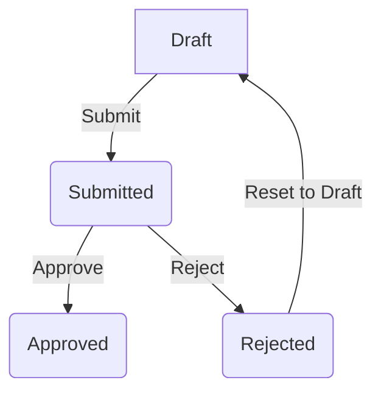
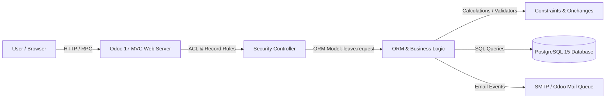

# 🚀 Leave Request Approval Module (Odoo 17)


A production-style, fully tested **Odoo 17 custom module** that streamlines employee leave management with HR integration, role-based access control (RBAC), automated approval workflows, and analytical reporting.

This project showcases professional Odoo development practices, including ORM modeling, workflow automation, security rules, XML views, automated unit testing, email notification templates, Docker deployment, and reporting dashboards.

---

## 📋 Table of Contents

- [Features](#features)
- [Key Enhancements](#key-enhancements)
- [Technology Stack](#technology-stack)
- [Project Workflow](#project-workflow)
- [Screenshots & Video Demo](#screenshots--video-demo)
- [System Architecture](#system-architecture)
- [Repository Structure](#repository-structure)
- [Installation](#installation)
- [Database Access (pgAdmin 4)](#database-access-pgadmin-4)
- [Automated Testing](#automated-testing)
- [Developer Guide (Upgrading Code)](#developer-guide-upgrading-code)
- [Usage](#usage)
- [Technical Design](#technical-design)
- [Security Model](#security-model)
- [Email Notifications](#email-notifications)
- [Future Extensions](#future-extensions)
- [Author](#author)

---

## Features

### 👨💼 Leave Management
- Create employee leave requests (pre-populated using the active user account)
- Multi-stage approval workflow (Draft, Submitted, Approved, Rejected)
- Computed leave duration calculation
- Reset rejected requests back to draft

### 🏢 HR Integration
- Uses Odoo's native **`hr.employee`** model
- Links employees and approvers to official HR records
- Zero data redundancy

### 🔒 Role-Based Security (RBAC)
- Employee access limited to their own requests or requests assigned to them for approval
- Managers have full system access
- UI-level action buttons (Approve/Reject) are hidden from regular employees using group constraints

### 📧 Automated Email Notifications
- Automatic email notification dispatched to the assigned approver upon submission
- Automatic email sent to the employee when their request is approved or rejected
- Formal HTML email templates built directly into Odoo

### 🤖 Workflow Automation
- Automatic approval activities/tasks generated for approvers upon submission
- Chatter logs every workflow action and status change
- Activities are automatically marked as completed after approval or rejection

### 📊 Analytics & Dashboards
- Kanban workflow pipeline grouped by status
- Pivot table reports
- Graph chart reports
- Search filters for common scenarios (My Requests, Pending Approval)

### 🐳 DevOps & Deployment
- Fully Dockerized (Odoo 17 + PostgreSQL 15)
- Quick setup using environment variables via `.env` file

---

## Key Enhancements

Here are the advanced features implemented in this module that go **beyond the basic requirements** to demonstrate production-grade Odoo development and software engineering practices:

### 🧪 1. 100% Automated Unit Testing Suite
- Implemented a complete Python unit testing suite under `tests/test_leave_request.py` verifying:
  - Computed durations and date validation boundaries.
  - Odoo To-Do activity generation and automated completion feedback.
  - Security role separation and assigned approver validation.
  - Overlapping date checks and annual leave limit restrictions.
- Tests can be run inside the Docker container with a single CLI command.

### 🛡️ 2. Intelligent Database Constraints (Business Rules)
- **Overlapping Leaves Check**: Implemented a database-level `@api.constrains` check that blocks employees from applying for duplicate leaves on overlapping dates.
- **Annual Leave Limit (20-day limit)**: Restricts employees from receiving approval for more than 20 days of total leave in a calendar year, returning the remaining balance to the manager upon block.

### 🎨 3. Modern UI/UX Polishing
- **Horizontal Radio Buttons**: Replaced standard dropdowns for leave types with clean, horizontal radio buttons inside the form.
- **User Avatar Badges**: Utilized `many2one_avatar_user` widgets to show employee profile pictures directly inside list columns and form selections.
- **Visual Kanban Cards**: Optimized Kanban layout with employee profile picture fills, shadows, and inline font-awesome icons.

### 🐳 4. Port Isolation & pgAdmin Connectivity
- Remapped the default PostgreSQL port from `5432` to `5435` inside `.env` to prevent port conflicts with local SQL databases.
- Allowed pgAdmin 4 to connect seamlessly to Odoo's database tables.

### 📧 5. Dynamic HTML Email Notifications
- Formatted formal HTML email notification templates inside `data/leave_request_mail_templates.xml` that automatically dispatch to employees and managers during submission and approval/rejection.

---

## Technology Stack

- **Odoo 17**
- **Python (Odoo ORM & Unittest)**
- **PostgreSQL 15**
- **Docker & Docker Compose**
- **XML Views**
- **Odoo Security (ACL & Record Rules)**
- **Mail Thread & Activities**

---

## Project Workflow



---

## 📸 Screenshots & Video Demo

To display your screenshots and videos on your repository, upload them to a `docs/screenshots/` folder in your project root using the filenames specified below:

| Kanban Workflow Pipeline | Form View with Radio & Avatars |
|:---:|:---:|
|  |  |

| Pivot Analytical Table | Graph Visualization |
|:---:|:---:|
|  |  |

### 🎥 Full Workflow Demonstration


*(You can view the high-definition recording in [docs/screenshots/workflow_demo.mp4](docs/screenshots/workflow_demo.mp4))*

---

## System Architecture



---

## Repository Structure

```text
odoo-leave-request-module/
├── addons/
│   └── leave_request/
│       ├── __init__.py
│       ├── __manifest__.py
│       ├── data/
│       │   ├── leave_request_data.xml             # Auto-sequence definition
│       │   ├── leave_request_demo.xml             # Demo employees & leave data
│       │   └── leave_request_mail_templates.xml   # Submission/Approval/Rejection email templates
│       ├── models/
│       │   ├── __init__.py
│       │   └── leave_request.py                   # Business logic, constraints, workflows
│       ├── security/
│       │   ├── ir.model.access.csv                # Model CRUD access control list (ACL)
│       │   └── leave_request_security.xml         # Security groups & record-level access rules
│       ├── tests/
│       │   ├── __init__.py
│       │   └── test_leave_request.py              # Python automated unit tests
│       └── views/
│           └── leave_request_views.xml            # Tree, Form, Kanban, Pivot, Graph, and Search views
├── config/
│   └── odoo.conf                                  # Odoo server configurations
├── .env                                           # Port and Database environment configs
├── docker-compose.yml                             # Container definitions
└── README.md
```

---

## Installation

### 1. Prerequisites
Install the following software:
- Docker Desktop
- Docker Compose
- pgAdmin 4 (optional, for database inspection)

---

### 2. Configure Environment Variables
Create a `.env` file in the root directory (a sample is provided):
```ini
ODOO_PORT=8070
POSTGRES_PORT=5435
POSTGRES_DB=postgres
POSTGRES_USER=odoo
POSTGRES_PASSWORD=odoo
```

---

### 3. Start the Application
Run the following command to spin up the Odoo and PostgreSQL containers:
```bash
docker compose up -d
```
Odoo will be accessible at `http://localhost:8070`.

---

### 4. Create a Database (First Run Only)
On the database creation screen, use the following values:

| Field | Value |
|-------|-------|
| Master Password | Copy the `admin_passwd` value from `config/odoo.conf` (e.g. `admin_passwd`) |
| Database Name | `leave_request_db` |
| Email / Login | `admin` |
| Password | `admin` |
| Load Demo Data | **Check this box** to load sample employee profiles and leave requests |

---

### 5. Install the Module
1. Log in as the administrator (`admin`).
2. Go to **Settings** > scroll to the bottom > click **Activate the developer mode**.
3. Open the **Apps** menu.
4. Click **Update Apps List** in the top navigation bar.
5. Search for `Leave Request Approval` (technical name: `leave_request`).
6. Click **Activate** to install.

---

## Database Access (pgAdmin 4)

To inspect the database tables using **pgAdmin 4** installed on your host machine:

1. Open **pgAdmin 4**.
2. Right-click **Servers** > **Register** > **Server...**
3. In the **General** tab, set Name to `Odoo Leave DB`.
4. In the **Connection** tab, input:
   - **Host name/address**: `localhost`
   - **Port**: `5435` (mapped in `.env` to avoid local host conflicts)
   - **Maintenance database**: `postgres`
   - **Username**: `odoo`
   - **Password**: `odoo`
5. Click **Save**.
6. Once connected, browse your tables under:
   `Databases` > `leave_request_db` > `Schemas` > `public` > `Tables` > `leave_request`

---

## Automated Testing

We have implemented automated Python unit tests covering all core requirements, including leave duration calculation, date constraints, and security role separation.

To run the test suite inside the running Docker container, execute:
```bash
docker exec -i odoo_leave_module-web-1 odoo -c /etc/odoo/odoo.conf -d leave_request_db -i leave_request --test-enable --stop-after-init
```

---

## Developer Guide (Upgrading Code)

If you modify the source files of this module, follow these steps to apply changes:

### 🐍 Modifying Python Code (`models/` or `tests/`)
Since Odoo loads Python classes into memory at startup, you must restart the Odoo container before upgrading the module in Odoo's interface:
```bash
# 1. Restart the Odoo Web Container
docker restart odoo_leave_module-web-1

# 2. Upgrade the module in Odoo's UI (under Apps > Upgrade)
```

### 🎨 Modifying Views / XML Data (`views/` or `data/` or `security/`)
XML files are loaded directly into the database. You do not need to restart the container, simply run the upgrade in the UI:
1. Go to **Apps** > search `leave_request`.
2. Click **Upgrade**.

---

## Usage

### Employee
- Create a leave request (your Employee profile pre-populates automatically).
- Select leave type and choose start and end dates (warnings trigger if end date is prior to start date).
- Select an approver and click **Submit**.

### Approver
- Receive an activity notification and a formal email.
- Review the request under **Pending Approvals**.
- Click **Approve** or **Reject** (buttons are hidden from regular employees).

### Manager
- Access every leave request in the system.
- View pivot tables, bar charts, and kanban pipelines.

---

## Technical Design

### Model Name
`leave.request`

### Inherits
- `mail.thread`
- `mail.activity.mixin`

---

### Main Fields

| Field | Type | Description |
|--------|------|-------------|
| `name` | Char | Auto-generated sequence (`LR-00001`) |
| `employee_id` | Many2one (`hr.employee`) | Employee requesting leave |
| `approver_id` | Many2one (`hr.employee`) | Assigned approver (filtered to Managers only) |
| `leave_type` | Selection | Sick, Casual, Annual, or Unpaid |
| `start_date` | Date | Leave start date |
| `end_date` | Date | Leave end date |
| `total_leave_days` | Integer | Computed leave duration |
| `status` | Selection | Draft, Submitted, Approved, Rejected |

---

## Business Logic

### Leave Duration
Calculated dynamically in Python:
```python
(end_date - start_date).days + 1
```

### Validation Rules
- End date cannot be before the start date (enforced by python `@api.constrains` and UI-level `@api.onchange`).
- Only the assigned approver can approve or reject the request.

---

## Security Model

### User Groups
1. **Leave Employee** (`group_leave_employee`):
   - Can create and submit requests.
   - Can read and write only their own requests or requests where they are assigned as the approver.
2. **Leave Manager** (`group_leave_manager`):
   - Full read/write/delete access to all records.
   - Can view the Approve/Reject buttons.

---

### Record Rules

#### Employee Rule
```python
['|', ('employee_id.user_id', '=', user.id), ('approver_id.user_id', '=', user.id)]
```

#### Manager Rule
```python
[(1, '=', 1)]
```

---

## Email Notifications

The system triggers formal email notifications using Odoo's mail templates when record states change:
1. **On Submission**: An email is dispatched to the assigned approver with details of the requester, leave type, and duration.
2. **On Approval/Rejection**: The employee receives an immediate notification stating whether their request has been approved or rejected, along with the name of the final approver.

---

## Future Extensions

How this module can be extended for advanced requirements:
1. **Leave Balance Tracking**: Add a many-to-one relationship to a new `leave.allocation` model to deduct computed leave days from an employee's annual balance and raise a `ValidationError` if the requested days exceed the remaining balance.
2. **Multi-level Approvals**: Refactor `status` selection to include multiple sub-stages (e.g. `hr_submitted`, `dept_approved`) and dynamically assign Odoo activities to department heads first, and then to HR managers.
3. **Integration with Odoo Calendar**: Link the leave model with Odoo's default `calendar.event` model to block days off in the company's shared calendar automatically upon approval.

---

## Author

**Md. Shahrul Zakaria**

GitHub: [https://github.com/bringerofdarkness](https://github.com/bringerofdarkness)